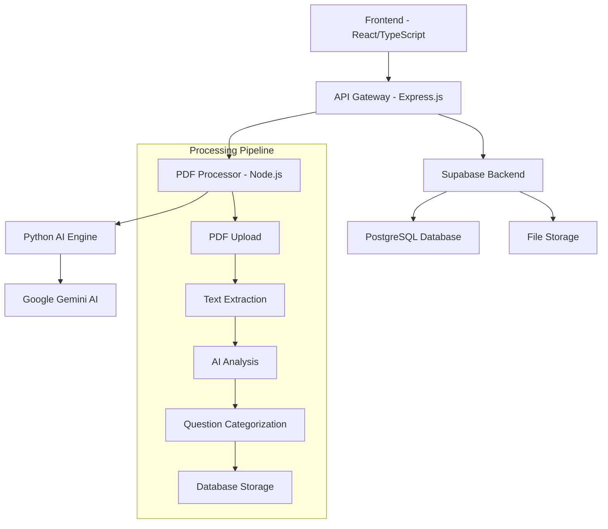

<div align="center">
  <h1>🎓 EduPapers</h1>
  <p><strong>AI-Powered Question Paper Management System</strong></p>
  
  <p>
    
    
    
    
  </p>
  
  <p>
    
    
    
  </p>
</div>

---

## 📋 Table of Contents

- [Overview](#-overview)
- [Recent Updates](#-recent-updates)
- [Features](#-features)
- [Architecture](#-architecture)
- [Quick Start](#-quick-start)
- [Installation](#-installation)
- [Configuration](#-configuration)
- [Usage](#-usage)
- [API Documentation](#-api-documentation)
- [Development](#-development)
- [Testing](#-testing)
- [Deployment](#-deployment)
- [Contributing](#-contributing)
- [Support](#-support)
- [License](#-license)

---

## 🎯 Overview

**EduPapers** is a comprehensive, AI-powered question paper management system designed for educational institutions, students, and educators. The platform streamlines the process of organizing, processing, and sharing examination papers with intelligent question extraction and categorization capabilities.

### 🌟 Key Highlights

- **🤖 AI-Powered Processing**: Leverages Google Gemini AI for intelligent question extraction and analysis
- **📊 Smart Organization**: Automatically categorizes papers by university, course, semester, and subject
- **🔒 Secure & Scalable**: Built with modern security practices and scalable architecture
- **📱 Responsive Design**: Seamless experience across desktop, tablet, and mobile devices
- **⚡ Real-time Updates**: Live progress tracking and instant feedback during processing

---

## 🔄 Recent Updates

### Version 2.0.0 - Project Reorganization

**🎯 Major Improvements:**
- **🏗️ Restructured Architecture**: Separated frontend and backend into dedicated directories
- **🐛 Bug Fixes**: Fixed notification issues showing "0 questions" during processing
- **🧹 Code Cleanup**: Removed unused test files, debug scripts, and temporary files
- **📦 Dependency Management**: Separate package.json for frontend and backend services
- **🚀 Enhanced Deployment**: Improved build process and deployment configuration

**📁 New Structure:**
- `/frontend/` - React TypeScript application with Vite
- `/backend/` - Node.js API server and Python AI processing engine
- Clean separation of concerns for better maintainability

**🔧 Fixed Issues:**
- Resolved "Processing completed! Found 0 questions" false notifications
- Fixed hardcoded "0" display during PDF processing
- Improved error handling and user feedback
- Updated all internal references and import paths

---

## ✨ Features

### 🎓 Core Functionality

| Feature | Description | Status |
|---------|-------------|--------|
| **PDF Upload & Processing** | Drag-and-drop PDF upload with intelligent text extraction | ✅ |
| **AI Question Extraction** | Advanced OCR and AI-powered question identification | ✅ |
| **Smart Categorization** | Automatic organization by academic hierarchy | ✅ |
| **Multi-format Support** | Support for various PDF formats and layouts | ✅ |
| **Progress Tracking** | Real-time processing status with detailed feedback | ✅ |
| **Search & Filter** | Advanced search across questions and papers | ✅ |
| **User Management** | Role-based access control (Student, Pro, Admin) | ✅ |
| **Export Options** | Multiple export formats (JSON, PDF, etc.) | ✅ |

### 🔧 Technical Features

- **Modern Tech Stack**: React 18, TypeScript, Node.js, Python
- **Database**: Supabase with PostgreSQL backend
- **Authentication**: Secure user authentication and authorization
- **File Storage**: Cloud-based file storage and management
- **API Integration**: RESTful APIs with comprehensive error handling
- **Build System**: Vite with optimized production builds
- **Styling**: Tailwind CSS with responsive design patterns

---

## 🏗️ Architecture



### 📁 Project Structure

```
EduPapers/
├── 📂 frontend/                # Frontend application
│   ├── 📂 src/                # React source code
│   │   ├── 📂 components/     # Reusable React components
│   │   ├── 📂 pages/          # Application pages
│   │   ├── 📂 contexts/       # React contexts (Auth, etc.)
│   │   ├── 📂 hooks/          # Custom React hooks
│   │   ├── 📂 lib/            # External integrations
│   │   └── 📂 types/          # TypeScript definitions
│   ├── 📂 public/             # Static assets
│   ├── 📂 config/             # Build & deployment configs
│   │   ├── vite.config.ts     # Vite configuration
│   │   ├── tailwind.config.js # Tailwind CSS config
│   │   └── tsconfig.json      # TypeScript config
│   ├── index.html             # Main HTML template
│   └── package.json           # Frontend dependencies
│
├── 📂 backend/                 # Backend services
│   ├── 📂 server/             # Node.js API server
│   │   ├── index.js           # Main API server
│   │   └── pdf-processor.js   # PDF processing service
│   ├── 📂 PDF Question Processor/ # AI processing engine
│   │   ├── 📂 src/            # Python source code
│   │   ├── 📂 config/         # Configuration files
│   │   └── 📂 output/         # Processing results
│   ├── 📂 temp-processing/    # Temporary file storage
│   ├── package.json           # Backend Node.js dependencies
│   ├── requirements.txt       # Python dependencies
│   └── runtime.txt            # Python runtime version
│
├── 📂 docs/                    # Documentation
├── 📂 database/                # Database schemas & migrations
├── 📂 scripts/                 # Utility scripts
├── .env                        # Environment variables
└── README.md                   # This file
```

---

## 🚀 Quick Start

### Prerequisites

Ensure you have the following installed:

- **Node.js** >= 18.0.0
- **Python** >= 3.8
- **npm** or **yarn**
- **Git**

### One-Command Setup

```bash
# Clone and setup the entire project
git clone https://github.com/your-username/edupapers.git
cd edupapers && npm install && npm run setup
```

> **Note**: This project has been recently reorganized with separate `frontend/` and `backend/` directories for better maintainability and deployment flexibility.

### Manual Setup

1. **Clone Repository**
   ```bash
   git clone https://github.com/your-username/edupapers.git
   cd edupapers
   ```

2. **Install Frontend Dependencies**
   ```bash
   cd frontend
   npm install
   cd ..
   ```

3. **Install Backend Dependencies**
   ```bash
   cd backend
   npm install
   pip install -r requirements.txt
   cd ..
   ```

4. **Environment Setup**
   ```bash
   cp .env.example .env
   # Configure your environment variables
   ```

5. **Start Development**
   ```bash
   # Start both frontend and backend
   npm run dev-with-processor
   
   # Or start individually:
   npm run frontend:dev     # Frontend only
   npm run backend:dev      # Backend only
   ```

---
## ⚙️ Configuration

### Environment Variables

Create a `.env` file in the project root with the following configuration:

```env
# Supabase Configuration (Required)
VITE_SUPABASE_URL=https://your-project.supabase.co
VITE_SUPABASE_ANON_KEY=your-supabase-anon-key
SUPABASE_SERVICE_ROLE_KEY=your-service-role-key

# PDF Processing Service
VITE_WEBHOOK_URL=http://localhost:8000/webhook/process-pdf

# AI Integration
GEMINI_API_KEY=your-google-gemini-api-key

# Firebase Authentication (Optional)
VITE_FIREBASE_API_KEY=your-firebase-api-key
VITE_FIREBASE_AUTH_DOMAIN=your-project.firebaseapp.com
VITE_FIREBASE_PROJECT_ID=your-project-id
VITE_FIREBASE_STORAGE_BUCKET=your-project.appspot.com
VITE_FIREBASE_MESSAGING_SENDER_ID=your-sender-id
VITE_FIREBASE_APP_ID=your-app-id
```

### 🔧 Supabase Setup

1. **Create a Supabase Project**:
   - Go to [supabase.com](https://supabase.com)
   - Create a new project
   - Note your project URL and anon key

2. **Create Storage Bucket**:
   ```sql
   -- Create a storage bucket for question papers
   INSERT INTO storage.buckets (id, name, public) VALUES ('question-papers', 'question-papers', true);
   
   -- Alternative bucket names (the app will try these automatically):
   -- 'documents', 'uploads', 'files'
   ```

3. **Set up Database Tables**:
   ```sql
   -- Create question_papers table
   CREATE TABLE question_papers (
     id UUID DEFAULT gen_random_uuid() PRIMARY KEY,
     title TEXT NOT NULL,
     file_url TEXT NOT NULL,
     file_path TEXT NOT NULL,
     university_id TEXT NOT NULL,
     course_id TEXT NOT NULL,
     semester TEXT NOT NULL,
     year INTEGER NOT NULL,
     subject TEXT,
     uploader_name TEXT NOT NULL,
     uploaded_by UUID REFERENCES auth.users(id),
     processing_status TEXT DEFAULT 'pending',
     created_at TIMESTAMP WITH TIME ZONE DEFAULT NOW()
   );
   ```

4. **Configure Row Level Security (RLS)**:
   ```sql
   -- Enable RLS
   ALTER TABLE question_papers ENABLE ROW LEVEL SECURITY;
   
   -- Allow authenticated users to read all papers
   CREATE POLICY "Allow authenticated read" ON question_papers FOR SELECT TO authenticated USING (true);
   
   -- Allow authenticated users to insert their own papers
   CREATE POLICY "Allow authenticated insert" ON question_papers FOR INSERT TO authenticated WITH CHECK (auth.uid() = uploaded_by);
   ```

### ⚠️ Important Notes

- **Required**: The `VITE_SUPABASE_URL` and `VITE_SUPABASE_ANON_KEY` are required for the application to function
- **Storage**: The app will automatically try multiple bucket names if the primary one doesn't exist
- **Error Handling**: Detailed error messages will guide you through any configuration issues

### Configuration Files

| File | Purpose | Location |
|------|---------|----------|
| `vite.config.ts` | Build configuration | `/frontend/config/` |
| `tailwind.config.js` | Styling configuration | `/frontend/config/` |
| `tsconfig.json` | TypeScript configuration | `/frontend/config/` |
| `eslint.config.js` | Code linting rules | `/frontend/config/` |
| `postcss.config.js` | CSS processing | `/frontend/config/` |

---

## 💻 Usage

### 1. Starting the Development Environment

```bash
# Start both frontend and backend services
npm run dev-with-processor

# Or start services individually
npm run frontend:dev     # Frontend only (localhost:5173)
npm run backend:dev      # Backend only (localhost:8000)
```

### 2. Accessing the Application

- **Frontend**: http://localhost:5173
- **API Server**: http://localhost:8000
- **Health Check**: http://localhost:8000/health

### 3. PDF Processing Workflow

1. **Upload**: Drag and drop PDF files or click to browse
2. **Processing**: AI automatically extracts questions and metadata
3. **Review**: View extracted questions with categorization
4. **Save**: Store processed data in the database
5. **Export**: Download results in various formats

---

## 📡 API Documentation

### Core Endpoints

#### PDF Processing
```http
POST /webhook/process-pdf
Content-Type: application/json

{
  "file_url": "https://example.com/paper.pdf",
  "metadata": {
    "university": "University Name",
    "course": "Course Name",
    "semester": "Semester",
    "subject": "Subject Name"
  }
}
```

#### Status Checking
```http
GET /status/:processing_id
```

#### Health Check
```http
GET /health
```

### Response Formats

```json
{
  "success": true,
  "status": "completed",
  "data": {
    "questions": [...],
    "metadata": {...},
    "processing_time": "2.5s"
  }
}
```

---

## 🛠️ Development

### Available Scripts

| Command | Description |
|---------|-------------|
| `npm run dev-with-processor` | Start both frontend and backend |
| `npm run frontend:dev` | Start frontend development server |
| `npm run backend:dev` | Start backend services |
| `npm run frontend:build` | Build frontend for production |
| `npm run frontend:preview` | Preview frontend production build |
| `npm run frontend:lint` | Run ESLint on frontend |
| `npm run frontend:type-check` | Run TypeScript checks |

### Development Guidelines

1. **Code Style**: Follow ESLint and Prettier configurations
2. **TypeScript**: Maintain strict type checking
3. **Testing**: Write tests for new features
4. **Documentation**: Update docs for API changes
5. **Commits**: Use conventional commit messages

### 📂 Working with the New Structure

**Frontend Development:**
```bash
cd frontend
npm run dev          # Start frontend dev server
npm run build        # Build for production
npm run lint         # Run linting
npm run type-check   # TypeScript validation
```

**Backend Development:**
```bash
cd backend
npm run start        # Start Node.js server
python -m src.main   # Run Python processor directly
```

**Full Stack Development:**
```bash
# From project root
npm run dev-with-processor  # Start both services
```

### Project Structure Details

```
frontend/src/
├── components/          # Reusable UI components
│   ├── Navbar.tsx      # Navigation component
│   ├── UniversityCard.tsx # University display card
│   └── QuestionEditor.tsx # Question editing interface
├── pages/              # Route-based page components
│   ├── Home.tsx        # Landing page
│   ├── Upload.tsx      # PDF upload interface
│   └── Profile.tsx     # User profile page
├── contexts/           # React Context providers
│   └── AuthContext.tsx # Authentication context
├── hooks/              # Custom React hooks
│   └── useDebounce.ts  # Debounce utility hook
├── lib/                # External service integrations
│   ├── supabase.ts     # Supabase client
│   └── firebase.ts     # Firebase configuration
└── types/              # TypeScript type definitions
    ├── index.ts        # Common types
    └── supabase.ts     # Database types

backend/
├── server/             # Node.js API services
│   ├── index.js        # Main API server
│   └── pdf-processor.js # PDF processing service
├── PDF Question Processor/ # Python AI engine
│   ├── src/            # Python source code
│   └── config/         # Configuration files
└── temp-processing/    # Temporary file storage
```

---

## 🧪 Testing

### Running Tests

```bash
# Run all tests
npm test

# Run specific test suites
npm run test:unit
npm run test:integration
npm run test:e2e

# Test coverage
npm run test:coverage
```

### Test Utilities

```bash
# Test PDF processing
node scripts/test-pdf-processing.js

# Test file downloads
node scripts/test-download.js

# Validate project structure
node scripts/show-structure.js
```

### Testing Guidelines

- Write unit tests for utility functions
- Integration tests for API endpoints
- E2E tests for critical user workflows
- Maintain >80% code coverage

---

## 🚀 Deployment

### Production Build

```bash
# Build the frontend application
cd frontend
npm run build

# Preview the build
npm run preview
```

### Deployment Platforms

#### Vercel (Recommended)
```bash
# Install Vercel CLI
npm i -g vercel

# Deploy
vercel --prod
```

#### Azure Static Web Apps
```bash
# Use the configuration in config/staticwebapp.config.json
```

#### Manual Deployment
```bash
# Build and serve
npm run build
serve -s dist
```

### Environment Setup

1. Set up environment variables on your platform
2. Configure database migrations
3. Set up file storage buckets
4. Configure AI service API keys

---

## 📚 Documentation

Comprehensive documentation is available in the `/docs` directory:

- **[Integration Guide](docs/SUPABASE_INTEGRATION_GUIDE.md)** - Database setup and configuration
- **[PDF Processing](docs/PDF_PROCESSING_INTEGRATION.md)** - AI processing pipeline details
- **[Troubleshooting](docs/TROUBLESHOOTING.md)** - Common issues and solutions
- **[API Reference](docs/API_REFERENCE.md)** - Complete API documentation
- **[Deployment Guide](docs/DEPLOYMENT_GUIDE.md)** - Production deployment instructions

---

## 🤝 Contributing

We welcome contributions! Please follow these steps:

1. **Fork the repository**
2. **Create a feature branch**
   ```bash
   git checkout -b feature/amazing-feature
   ```
3. **Make your changes**
4. **Add tests** for new functionality
5. **Commit your changes**
   ```bash
   git commit -m 'feat: add amazing feature'
   ```
6. **Push to the branch**
   ```bash
   git push origin feature/amazing-feature
   ```
7. **Open a Pull Request**

### Contribution Guidelines

- Follow existing code style and patterns
- Write clear, descriptive commit messages
- Add tests for new features
- Update documentation as needed
- Ensure all tests pass before submitting

---

## 🆘 Support

### Getting Help

1. **Documentation**: Check the `/docs` directory first
2. **Issues**: Search existing GitHub issues
3. **Discussions**: Join our community discussions
4. **Email**: Contact us at support@edupapers.com

### Reporting Issues

When reporting issues, please include:

- Operating system and version
- Node.js and Python versions
- Steps to reproduce
- Expected vs actual behavior
- Screenshots (if applicable)

### Feature Requests

We welcome feature requests! Please:

1. Check existing issues and discussions
2. Provide clear use cases
3. Explain the expected behavior
4. Consider contributing the feature yourself

---

## 📄 License

This project is licensed under the MIT License - see the [LICENSE](LICENSE) file for details.

```
MIT License

Copyright (c) 2025 EduPapers

Permission is hereby granted, free of charge, to any person obtaining a copy
of this software and associated documentation files (the "Software"), to deal
in the Software without restriction, including without limitation the rights
to use, copy, modify, merge, publish, distribute, sublicense, and/or sell
copies of the Software, and to permit persons to whom the Software is
furnished to do so, subject to the following conditions:

The above copyright notice and this permission notice shall be included in all
copies or substantial portions of the Software.
```

---

## 🙏 Acknowledgments

- **React Team** - For the amazing React framework
- **Supabase** - For the excellent backend-as-a-service platform
- **Google** - For the powerful Gemini AI API
- **Vercel** - For seamless deployment platform
- **Open Source Community** - For the fantastic tools and libraries

---

## 📊 Project Status

- **Current Version**: 1.0.0
- **Status**: Production Ready
- **Last Updated**: June 2025
- **Maintained**: ✅ Actively maintained
- **Security**: ✅ Regular security updates

---

<div align="center">
  <p><strong>Built with ❤️ by the EduPapers Team</strong></p>
  <p>
    <a href="https://edupapers.com">Website</a> •
    <a href="https://github.com/edupapers/edupapers">GitHub</a> •
    <a href="https://twitter.com/edupapers">Twitter</a> •
    <a href="mailto:support@edupapers.com">Email</a>
  </p>
</div>
